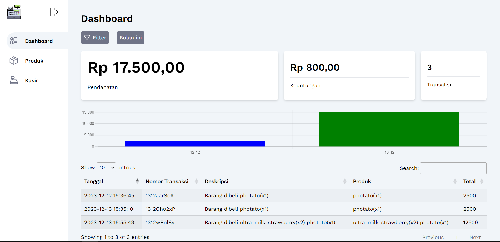
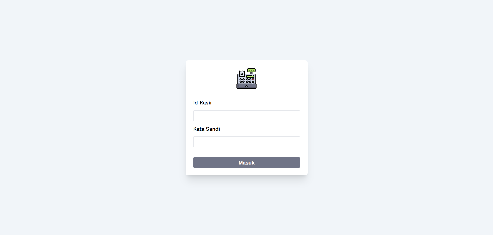

<p align="center"><strong>Kasir-Ku</strong></p>
<p align="center"><sub>Laravel Vue Datatable Sanctum Tailwind</sub></p>
<p align="center"><sub>Jangan lupa tekan 🌟</sub></p>

## Yang dibutuhkan
1. PHP V8.1 ke atas
2. Node.js / NPM V18.0 ke atas
3. Composer
4. Database MySql

## Langkah untuk menggunakan Kasir-Ku

1. ```git clone https://github.com/insanXYZ/Kasir-ku.git```
2. ```cd backend```
3. ```composer install```
4. ```npm install```
5. rubah ```.env.example``` menjadi ```.env```
6. buat database MySql anda dengan nama yang sama pada bagian ```DB_DATABASE``` pada ```.env```
7. ```php artisan key:generate```
8. ```php artisan migrate:fresh```
9. ```php artisan db:seed```
10. ```php artisan serve```
11. ```cd ../frontend```
12. ```npm install```
13. ```npm run dev```

## Fitur Kasir-ku

1. Tambah, Edit, Hapus Product
2. Dashboard berisi pendapatan bulanan, mingguan, harian atau custom tanggal dengan tampilan bar naik turun pendapatan, dan tabel sejarah transaksi
3. Kasir dengan input berupa kode-barqode barang, dapat mengubah jumlah barang yang dibeli, menambahkan diskon, input berapa uang yang diserahkan, dan diakhiri print thermal
