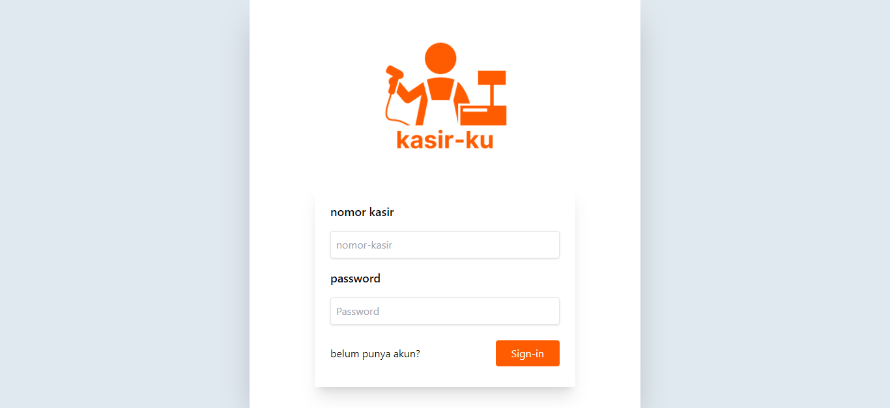
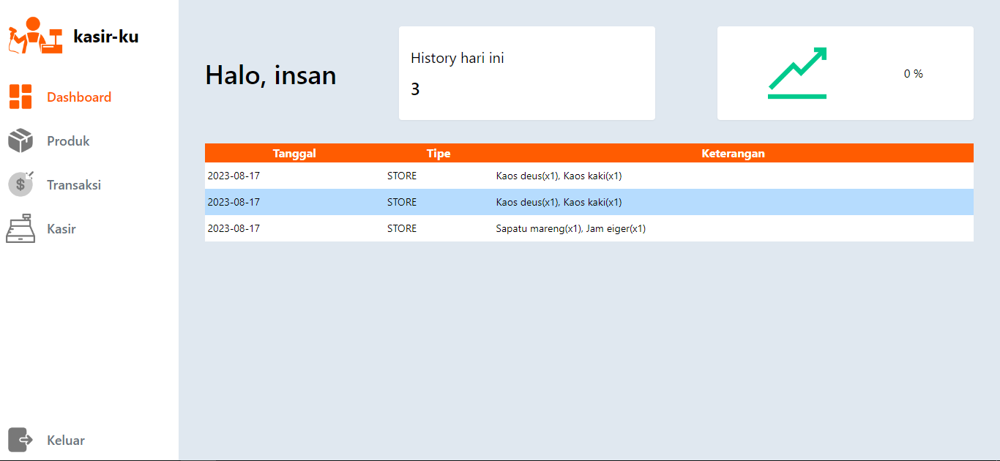

<p align="center"><strong>Kasir-ku | Atur barang daganganmu</strong></p>
<p align="center"><sub>Laravel Livewire Tailwind</sub></p>
<p align="center"><sub>Jangan lupa tekan 🌟</sub></p>

## Langkah untuk menggunakan Website Undangan Digital - diundang

1. ```git clone https://github.com/insanXYZ/Kasir-ku.git```
2. ```cd Kasir-ku```
3. export file kasir-ku.sql ke database
4. ```composer install```
5. ```npm install```
6. ```npm run dev```
7. ```php artisan serve```
8. buka ```http://127.0.0.1:8000``` di browser.

## Daftar Route diundang

Berikut adalah daftar route yang tersedia dalam proyek Laravel ini:

| Method    | URI                                |
|:----------|:-----------------------------------|
| GET|HEAD  | /                                  |
| GET|HEAD  | dashboard                          |
| GET|HEAD  | kasir                              |
| POST      | logout                             |
| GET|HEAD  | produk                             |
| GET|HEAD  | sign-in                            |
| POST      | sign-in                            |
| GET|HEAD  | sign-up                            |
| POST      | sign-up                            |
| GET|HEAD  | transaksi                          |

**Catatan:**
- `GET|HEAD` artinya route dapat diakses menggunakan metode HTTP GET atau HEAD.
- `URI` adalah bagian dari URL yang mengidentifikasi route.
- Kasir-ku bukanlah website untuk mengelola dagangan yang ditampilkan dengan gambar seperti kasir makanan cepat saji , namun ini hanya berupa teks seperti indoapril dan alphamaret

## Penggunaan di tiap tiap route kasir-ku
1. ```/sign-in```, tempat untuk login, masukkan nomor kasir dan password mu di kolom input yang tertera, Bagaimana cara mendapatkan nomor kasir? jika belum punya akun silahkan untuk tekan 'belum punya akun' di bawah kiri, dan untuk saat ini untuk melihatnya harus dengan melihat ke db 🙏🏻.
2. ```/sign-up```, daftar akun mu disini dengan memasukkan nama mu dan password.
3. ```/dashboard``` , disana nanti akan ada card history saat ini , persentase (perbandingan antara sekarang dan kemarin), dan tabel history saat ini , seperti misalnya setelah nanti membuat product di ```/produk``` , nantinya akan masuk ke history dengan tipe CREATE dsb.
4. ```/produk```, tempat untuk melihat identitas semua produk yang sudah dibuat, disana kita bisa mencari nya berdasarkan nama produk atau kode barqode nya , ataupun untuk generate JSON yang nantinya bisa di import ke excel guna untuk laporan, dan bisa untuk menambahkan lagi product.
5. ```/transaksi```, semua hal yang berkaitan dengan pendapatan dan apa saja barang yang sudah di jual/beli , itu terlihat disana.
6. ```/kasir```, disinilah tempat teman-teman untuk store atau menjadi layaknya seorang kasir , dengan memasukkan barqode ke kolom input disana nantinya akan muncul barang yang sudah dibarqode tersebut dan qty nya bisa dirubah, untuk melihat perubahan harga nanti bisa dilihat setelah menekan tombol beli, nantinya akan muncul modal yang dimana berisi semua barang yang tadi sekaligus itu adalah isi yang akan di print jika menekan print, <strong>PERLU DIKETAHUI,</strong> setelah menekan print yang pertama, nantinya itu akan langsung diproses oleh database, seperti halnya pengurangan qty, oleh karena itu pastikan terlebih dahulu produk nya sebelum menekan tombol print.
